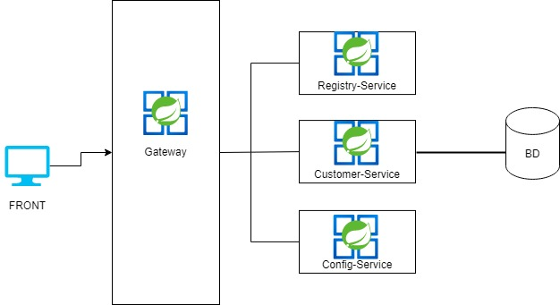

# intercorp Microservicio de Clientes

1. Descripcion de funcionamiento:
   Para la arquitectura de microservicios de este pequeño proyecto se realizo 4 proyectos donde se tiene las caracteristicas de la arquitectura.
   
- Gateway-Service: Punto de acceso de todos los microservicios.
- Registry-Service: Registrar los microservicios
- Config-Service: Registrar las configuraciones de los microservicios de forma centralizada.

2. Consideraciones:
- Para probar el microservicio solo, es decir, sin las demas las herramientas, se debe descargar el proyecto del siguiente repositorio.
- Para probar el microservicio son todas las herramientas de la arquitectura se lista las url de los repositorios de cada proyecto:
- [Config-Service](https://github.com/orlandovilca0796/intercorp-config-service.git)
- [Registry-Service](https://github.com/orlandovilca0796/intercorp-registry-service.git)
- [Customer-Service](https://github.com/orlandovilca0796/intercorp-customer-service.git)
- [Gateway-Service](https://github.com/orlandovilca0796/intercorp-gateway-service.git)

3. Pasos de instalacion:
   A continuacion se detallará la instalación del(los) proyectos para la pruebas de los endpoints.

   3.1. Base de Datos:

   Ejecutar el [script](BD.sql) para crear la BD

   3.2 Levantar proyecto:
      Ejecutar en el orden indicado
   - Primer proyecto: Levantar el proyecto Config-Service con el siguiente comando: mvn spring-boot:run
   - Segundo proyecto: Levantar el proyecto Registry-Service con el siguiente comando: mvn spring-boot:run
   - Tercer proyecto: Levantar el proyecto Customer-Service con el siguiente comando: mvn spring-boot:run -Dspring-boot.run.arguments="--spring.datasource.username=XXXXXXXXX --spring.datasource.password=XXXXXXXX". Completar el user y password de la BD.
   - Cuarto proyecto: Levantar el proyecto Gateway-Service con el siguiente comando: mvn spring-boot:run

4. Pruebas de los endpoints:
Importar el collection en postman: [Collection](IntercorpPrueba%20Gateway.postman_collection.json)
En el proyecto de customer-service hay 3 endpoints, se detalla a continuacion:
- searchCustomer: Busca los clientes por id(numero de documento) y/o email; si no ingresa ningun filtro, devuelve toda la lista de los clientes.
- saveCustomer: Registrar un nuevo cliente a la BD (todos los campos son obligatorios)
- calculateIndicators: Calcula los indicadores de tasa de natalidad de un mes/año, ademas trae el indicador de todos los mes/años que se encuentren en la BD.

5. Swagger:
Se genero el archivo .yml con openapi. [api-docs](api-docs.yaml)

